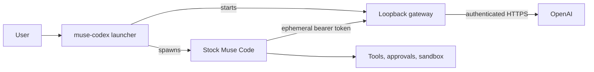

<p align="center">
  
</p>

<h1 align="center">Muse Codex</h1>

<p align="center"><strong>Keep the harness. Change the model.</strong></p>

<p align="center">
  An independent compatibility gateway for using OpenAI models through the stock Muse Code CLI.
</p>

<p align="center">
  <a href="https://github.com/Srimi1/muse-codex/actions/workflows/ci.yml"></a>
  <a href="LICENSE"></a>
  <a href="rust-toolchain.toml"></a>
  
  
</p>

> [!WARNING]
> **Experimental and source-only.** Muse Codex currently supports Apple-silicon
> macOS and exactly Muse Code `1.0.3-R2198.1`. Other Muse versions are rejected.
> No public binary release is available.

> [!IMPORTANT]
> Muse Codex is not affiliated with, endorsed by, or distributed by Meta or
> OpenAI. Install and license Muse Code separately through Meta's official
> channel.

## What it does

Muse Codex keeps the unmodified Muse executable in charge of the terminal UI,
sessions, prompts, tools, approvals, sandbox, skills, subagents, and worktrees.
It replaces only the model connection with a private loopback gateway backed by
the pinned OpenAI Codex client.

- **Preserves the host:** normal Muse commands and provider-independent behavior
  stay in the stock executable.
- **Isolates credentials:** Muse receives a short-lived loopback token, never an
  OpenAI credential.
- **Keeps tools local:** the gateway translates model traffic but never executes
  a model-requested tool.
- **Fails closed:** unsupported Muse builds, conflicting providers, unsafe
  endpoints, and unverifiable release artifacts are rejected.

### Ownership boundary

| Stock Muse owns | Muse Codex owns | Not included here |
| --- | --- | --- |
| TUI and exec mode | CLI routing and version gate | The proprietary Muse binary |
| Sessions and context | Isolated OpenAI authentication | OpenAI service access |
| Tools and approvals | Loopback gateway lifecycle | A public binary release |
| Sandbox and extensions | Model catalog and stream translation | Modified Muse host source |



See [Architecture](docs/ARCHITECTURE.md) and the
[Security model](docs/SECURITY.md) for the detailed boundaries.

## Compatibility

| Component | Supported baseline |
| --- | --- |
| Operating system | macOS on Apple silicon (`arm64`) |
| Muse Code | Exactly `1.0.3-R2198.1` |
| Rust | `1.93.0` for source builds |
| OpenAI Codex source | `rust-v0.133.0` at `9474e5cfc4494b0ba319352aa86ce436c59e65c8` |
| Authentication | ChatGPT browser/device login or an OpenAI API key |

The current Meta installer may provide a newer Muse build. Muse Codex does not
bypass its version gate; verify the installed binary before building:

```console
$ muse --version
Muse Code 1.0.3 (1.0.3-R2198.1)
```

If the output differs, this version of Muse Codex will not start a session.

## Quick start from source

Install the exact Muse prerequisite through
[Meta's official Muse Code installer](https://dev.meta.ai/install.sh), then:

```sh
git clone https://github.com/Srimi1/muse-codex.git
cd muse-codex

cargo build --workspace --release --locked

mkdir -p "$HOME/.local/bin"
install -m 0755 target/release/muse-codex "$HOME/.local/bin/muse-codex"
install -m 0755 target/release/muse-codex-gateway "$HOME/.local/bin/muse-codex-gateway"
```

The launcher and gateway must remain beside one another or both be available on
`PATH`. For a nonstandard Muse location, set `MUSE_CODEX_MUSE_BIN` to the exact
executable.

### Authenticate

Browser login is the default:

```sh
muse-codex login
```

For a terminal that cannot receive a browser callback:

```sh
muse-codex login --device-auth
```

Or store an OpenAI API key supplied over standard input:

```sh
printf '%s' "$OPENAI_API_KEY" | \
  muse-codex auth set --provider codex --api-key-stdin
```

ChatGPT subscription authentication and API-key billing are separate modes.
Muse Codex never silently falls back between them. Credentials are stored in an
isolated operating-system keyring namespace rather than a plaintext
`auth.json`.

### Run Muse

```sh
muse-codex
muse-codex exec "Explain the failing tests, then propose a fix"
muse-codex resume
```

Arguments unrelated to provider routing pass through to Muse. The public
provider is either omitted or explicitly `--provider codex`; other provider
values are rejected.

For complete setup, private signed-feed installation, environment variables,
and endpoint rules, see [Installation](docs/INSTALLATION.md) and
[Configuration](docs/CONFIGURATION.md).

## Security and privacy

The launcher removes inherited provider credentials before starting Muse. It
binds the compatibility gateway only to `127.0.0.1`, authenticates the local
hop with a random per-run token, and keeps OpenAI credentials inside the auth
and gateway boundary. A custom upstream base URL is accepted only with explicit
API-key authentication.

Review the [Security policy](.github/SECURITY.md) before deploying or reporting
an issue. Suspected vulnerabilities should be submitted through
[private vulnerability reporting](https://github.com/Srimi1/muse-codex/security/advisories/new),
not a public issue.

## Known limits

- The exact supported Muse build may no longer be the build served by Meta's
  moving installer.
- Transport compatibility does not imply that different models make identical
  tool choices or produce identical output.
- The ChatGPT backend is private and unstable. The vendored Codex source is open
  source, but its Rust crates are not a stable library API.
- Stock-vs-wrapped transcript tests and live OpenAI validation remain release
  gates; the public automated suite currently covers first-party unit tests,
  deterministic fixtures, and release tooling.
- New response event types, auxiliary routes, and Muse releases require explicit
  compatibility work before support is claimed.
- Hooks, MCP servers, skills, and plugins retain Muse's existing trust model.

Track planned qualification work in the [Roadmap](ROADMAP.md).

## Documentation

| Document | Contents |
| --- | --- |
| [Installation](docs/INSTALLATION.md) | Source builds and signed private-feed installation |
| [Configuration](docs/CONFIGURATION.md) | Environment, authentication, and endpoint behavior |
| [Architecture](docs/ARCHITECTURE.md) | Components, data flow, command routing, and failure rules |
| [Security model](docs/SECURITY.md) | Trust boundaries, protected assets, and residual risks |
| [Releasing](docs/RELEASING.md) | Private signed-release process and checklist |
| [Contributing](CONTRIBUTING.md) | Development workflow and review expectations |
| [Support](SUPPORT.md) | Supported scope and help channels |
| [Changelog](CHANGELOG.md) | User-visible project changes |

The official [Muse Code SDK](https://github.com/meta-models/muse-code-sdk) is a
useful reference for the Muse Session Protocol. The exact OpenAI source snapshot
used here is recorded under `vendor/openai-codex`.

## Development

```sh
cargo fmt -p codex-transport -p muse-codex -p muse-codex-gateway -- --check
cargo clippy --workspace --all-targets --locked -- -D warnings
cargo test --workspace --all-targets --locked
bash tests/scripts/release-tooling-test.sh
```

CI runs the same quality gates and an Apple-silicon release build. Unit and
fixture tests do not require live OpenAI or Meta credentials.

Contributions are welcome. Start with [CONTRIBUTING.md](CONTRIBUTING.md), use the
issue forms for scoped proposals and reproducible bugs, and keep security
reports private.

## License and trademarks

First-party source and project artwork are licensed under the
[Apache License 2.0](LICENSE). See [Third-party notices](THIRD_PARTY_NOTICES.md)
for vendored dependencies.

Muse, Muse Code, Muse Spark, Meta, OpenAI, ChatGPT, GPT, and Codex are trademarks
of their respective owners. This license does not grant rights to redistribute
third-party software or imply endorsement by any trademark owner.
